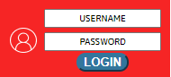
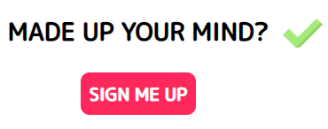
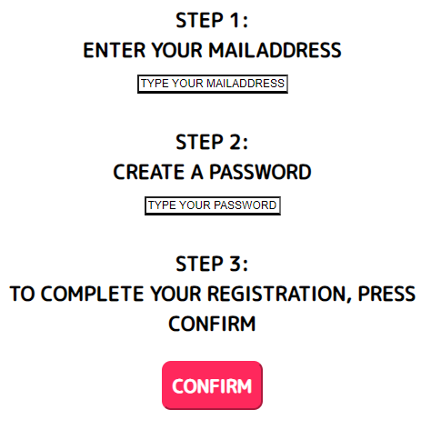
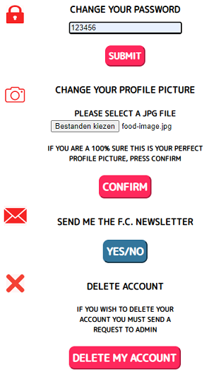
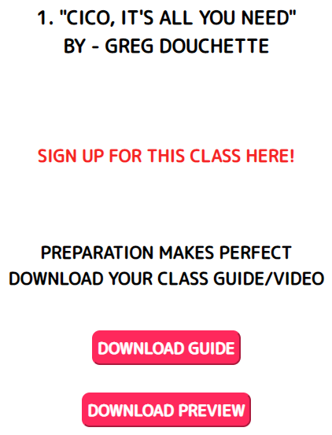
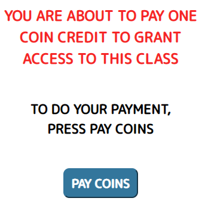
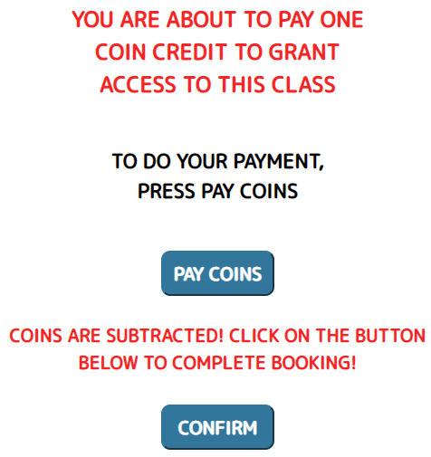
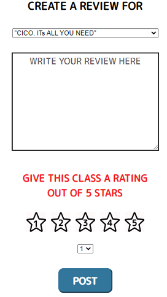

#Front-end instructies F.C.

Dit bestand bevat instructies en voorbeelden voor het gebruik van de Front-end van de F.C. applicatie.
Zorg ervoor dat je de gehele installatiehandleiding hebt gelezen voordat je begint te werken in dit project.

##Inhoud
* [Home-page](#Home-page)
* [Register-page](#Register-page)
* [Login-page](#Login-page)
* [Footer](#Footer)  
* [Settings-page](#Settings-page)
* [About-page](#About-page)
* [Newsletter-page](#Newsletter-page)
* [Categories-page](#Categories-page)
* [Nutrition-page](#Nutrition-page)
* [CICO-page](#CICO-page)
* [CICOPay-page](#CICOPay-page)
* [Review-page](#Review-page)
* [ReviewNutrition-page](#ReviewNutrition-page)
* [ReviewCICO-page](#ReviewCICO-page)
* [CreateReview-page](#CreatReview-page)
* [MyClasses-page](#MyClasses-page)

##Home-page
###Inloggen
De gebruiker kan inloggen met zijn **_'username'_** en **_'password'_**. Zie onderstaand voorbeeld:

**Toelichting**
Beide velden moeten gevuld zijn, en de username dient een '@' teken te bevatten.
Naast deze foutmeldingen zal de gebruiker ook een bericht krijgen wanneer de inlog gegevens niet overeenkomen met de gegevens in de database.

###Register-page
Deze button zal de gebruiker navigeren naar de 'Register-page'. Zie onderstaand voorbeeld:

##Register-page
De gebruiker kan op deze een account aanmaken met de volgende voorwaarden:
* De 'username' is een mailadres en bevat het '@' teken.
* De 'username' mag maximaal 50 tekens bevatten.  
* Het 'wachtwoord' moet minimaal 6 tekens lang zijn.

Zie onderstaand voorbeeld:

De volgende voorwaarden zijn nog van belang:

##Login-page
De gebruiker(die is ingelogd) vindt op deze pagina twee navigatie buttons:
* Naar de 'Newsletter-page'
* Naar de 'Categories-page'

##Footer (Logout/Settings)
De ingelogde gebruiker zal in de 'Footer' van de pagina een button vinden waarmij hij kan uitloggen.
Zie onderstaand voorbeeld:

In dezelfde footer zal ook een Link naar de 'Settings-page'.
Zie onderstaand voorbeeld:

##Settings-page
Hier vindt de gebruiker verschillende functies ten aanzien van zijn account.
Zie onderstaand voorbeeld:

**De volgende voorwaarden zijn nog van belang:**
* Het wachtwoord moet minimaal 6 tekens lang zijn.
* Om de functies 'ChangePassword' en 'UploadProfilePicture' te kunnen gebruiken moeten beide velden eerst gevuld te worden.
* Het bestand dat geüpload wordt als 'profilePicture' dient .jpg, .png of .pdf te zijn.

##About-page

Op deze pagina vind de gebruiker achtergrond informatie over de dienst die F.C. levert.

##Newsletter-page

Op deze pagina vind de gebruiker Links naar verschillende nieuwsbrieven.

##Categories-page
Op deze pagina vindt de gebruiker verschillende links naar categorieën van classes.

##Nutrition-page
Op deze pagina vindt de gebruiker verschillende links naar titels van classes.

##CICO-page
Op deze pagina vindt de gebruiker een link naar de 'CICOPay-page'
Ook vindt de gebruiker twee button voor het downloaden van een 'preview' en een 'guide'.
Zie onderstaand voorbeeld:

##CICOPay-page
Hier kan de gebruiker Coins inwisselen om aan 'class booking' te doen.
Zie onderstaand voorbeeld:

Als de betalingen successvol is zal een button verschijnen waarmee de gebruiker zijn 'booking' kan bevestigen.
Zie onderstaand voorbeeld:

**NB: Als de gebruiker niet genoeg Coins ter beschikking heeft zal hiervoer een foutmelding verschijnen!**

##Review-page
Op deze pagina vindt de gebruiker een link voor het aanmaken van een 'review' (de groene button'CreateReview').
Ook kan de gebruiken klikken op links voor verschilende categorieën.

##ReviewNutrition-page
Op deze pagina vindt de gebruiker verschillende links naar titels van classes.

##ReviewCICO-page
Op deze pagina vindt de gebruiker een button 'Get Reviews' om de 'reviews' te bekijken van 'CICO'.
Zie onderstaand voorbeeld:

**NB: Als het niet lukt om de gegevens op te halen verschijnt een foutmelding in beeld!**

##CreateReview-page
Op deze pagina kan de gebruiker een 'review' aanmaken en versturen met de button 'post'.
De volgende voorwaarden zijn van belang:
* Selecteer in de bovenste dropdown menu om welke class het gaat.
* De tekst van de 'review' mag maximaal 250 tekens bevatten.
* Selecteer in de onderste dropdown menu een 'rating' van 1-5.
Zie onderstaand voorbeeld:

##MyClasses-page
Op deze pagina vindt de gebruiker een button 'Get My Bookings'.
Hiermee kan de gebruiker zijn 'bookings' bekijken.
Zie het onderstaand voorbeeld:

**NB: Als het niet lukt om de gegevens op te halen verschijnt een foutmelding in beeld!**
